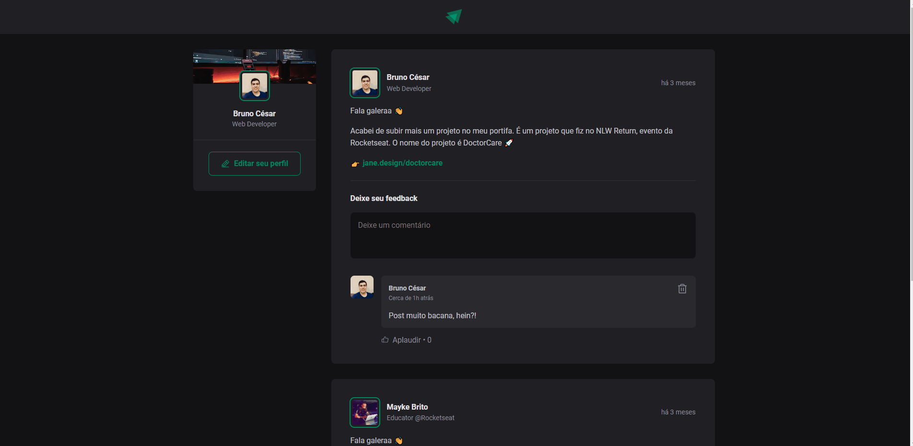

<h1 align="center">
  <span>Ignite Feed</span>
</h1>

<p align="center">
  <a href="#-projeto">Projeto</a>&nbsp;&nbsp;&nbsp;|&nbsp;&nbsp;&nbsp;
  <a href="#-layout">Layout</a>&nbsp;&nbsp;&nbsp;|&nbsp;&nbsp;&nbsp;
  <a href="#-tecnologias">Tecnologias</a>&nbsp;&nbsp;&nbsp;|&nbsp;&nbsp;&nbsp;
  <a href="#-instalação">Instalação</a>&nbsp;&nbsp;&nbsp;|&nbsp;&nbsp;&nbsp;
  <a href="#memo-licença">Licença</a>
</p>

<br>

<p align="center">
  
</p>

<br>

## 💻 Projeto

Aplicação desenvolvida durante o primeiro módulo do curso Ignite - Módulo 1 da Rocketseat. Objetivo dessa aplicação é um feed onde as pessoas podem logar e comentar os posts.

## 📟 Layout

O layout das telas da aplicação foi desenvolvido pela equipe da Rocketseat através do Figma. O layout pode ser acessado através deste link:
[**Ignite Feed**](https://www.figma.com/file/A7SaWFvjZywL0yEQOsyODE/Ignite-Feed-(Community)?node-id=0%3A1&t=FMEbEkXclOkrSIQJ-0).

## 🚀 Tecnologias

Esse projeto foi desenvolvido com as seguintes tecnologias:

- HTML
- CSS
- TypeScript
- ReactJS

## 📥 Instalação

Faça um clone desse repositório e acesse o diretório. Em instale todas as dependências com o seguinte comando:

```bash
npm i
```

Em seguida execute o servidor rodando
```bash
npm run dev
```


## :memo: Licença

Esse projeto está sob a licença MIT. Veja o arquivo [LICENSE](LICENSE.md) para mais detalhes.

---
**Desenvolvido por [Bruno César](https://github.com/brunocs90).**
