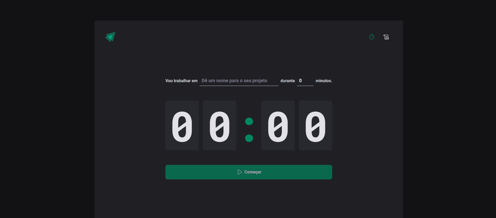

<h1 align="center">
  <span>Ignite Timer</span>
</h1>

<p align="center">
  <a href="#-projeto">Projeto</a>&nbsp;&nbsp;&nbsp;|&nbsp;&nbsp;&nbsp;
  <a href="#-layout">Layout</a>&nbsp;&nbsp;&nbsp;|&nbsp;&nbsp;&nbsp;
  <a href="#-tecnologias">Tecnologias</a>&nbsp;&nbsp;&nbsp;|&nbsp;&nbsp;&nbsp;
  <a href="#-instalação">Instalação</a>&nbsp;&nbsp;&nbsp;|&nbsp;&nbsp;&nbsp;
  <a href="#memo-licença">Licença</a>
</p>

<br>

<p align="center">
  
</p>

<br>

## 💻 Projeto

Projeto desenvolvido durante o segundo módulo da Trilha React.js do Ignite 2022 da Rocketseat. Este projeto é um timer onde podemos especificar uma determinada tarefa escolher o tempo e iniciar o timer.

## 📟 Layout

O layout das telas da aplicação foi desenvolvido pela equipe da Rocketseat através do Figma. O layout pode ser acessado através deste link:
[**Ignite Timer**](https://www.figma.com/file/k6DdabCdhBtkQDlAG8y0E9/Ignite-Timer-(Community)?t=FMEbEkXclOkrSIQJ-0).

## 🚀 Tecnologias

Esse projeto foi desenvolvido com as seguintes tecnologias:

- HTML
- CSS
- TypeScript
- ReactJS

## 📥 Instalação

Faça um clone desse repositório e acesse o diretório. Em instale todas as dependências com o seguinte comando:

```bash
npm i
```

Em seguida execute o servidor rodando
```bash
npm run dev
```


## :memo: Licença

Esse projeto está sob a licença MIT. Veja o arquivo [LICENSE](LICENSE.md) para mais detalhes.

---
**Desenvolvido por [Bruno César](https://github.com/brunocs90).**
