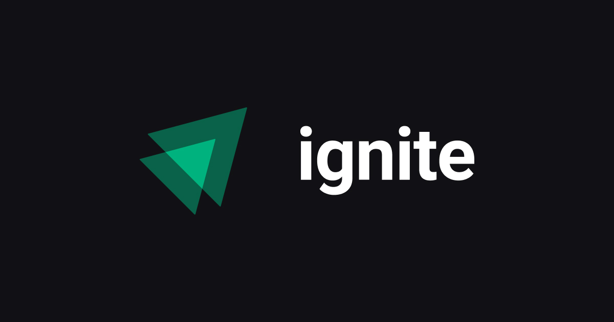

<h1 align="center">
  <span>Aulas Ignite ReactJs</span>
</h1>

<p align="center">
  <a href="#-projeto">Projeto</a>&nbsp;&nbsp;&nbsp;|&nbsp;&nbsp;&nbsp;
  <a href="#-índice">Índice</a>&nbsp;&nbsp;&nbsp;|&nbsp;&nbsp;&nbsp;
  <a href="#-instalação">Instalação</a>&nbsp;&nbsp;&nbsp;|&nbsp;&nbsp;&nbsp;
  <a href="#memo-licença">Licença</a>
</p>

<br>

<p align="center">
  
</p>

<br>

## 💻 Projeto

Este repositório contém os projetos desenvolvidos durante o curso de Ignite da [**Rocketseat**](https://github.com/Rocketseat), além do link para o repositório dos desafios.

## 🚀 Índice

### Projeto 01
- [Fundamentos do ReactJS](https://github.com/brunocs90/ignite-react-2022/tree/main/01-fundamentos-reactjs-ts)
- [Desafio: Praticando os conceitos do ReactJS](https://github.com/brunocs90/ignite-react-2022-desafios/tree/main/Desafio-01-todo-list)

### Projeto 02
- [Criando SPAs com ReactJS](https://github.com/brunocs90/ignite-react-2022/tree/main/02-ignite-timer)
- [Desafio: Coffee Delivery](https://github.com/brunocs90/ignite-react-2022-desafios/tree/main/Desafio-02-coffee-delivery)

### Projeto 03
- [Consumo de API e performance no ReactJS]()
- [Desafio: Github Blog]()

## 📥 Instalação

Faça um clone desse repositório e navegue através dos diretórios. Escolha o diretório e rode os seguintes comandos:

```bash
npm i
npm run dev

```
## :memo: Licença

Esse projeto está sob a licença MIT. Veja o arquivo [LICENSE](LICENSE.md) para mais detalhes.

---
**Desenvolvido por [Bruno César](https://github.com/brunocs90).**

